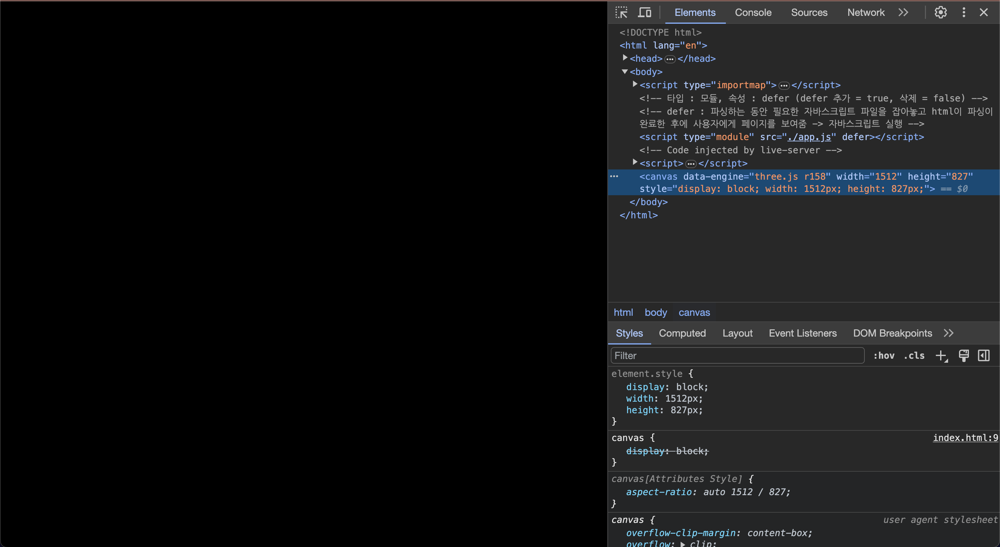
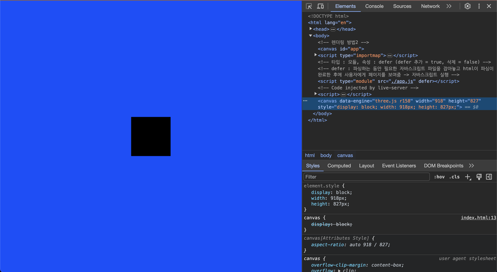

# Three.js
- 이 레파지토리는 유튜버 '디자인베이스'님의 강좌를 보면서 작성했습니다

## 1. 01_start : setting 
 - docs의 [설치](https://threejs.org/docs/index.html#manual/ko/introduction/Installation) 참고
 - npm i three

## 2. 02_basic : 기본 구조 이해하기
   

   1. Renderer : 카메라에 담긴 장면을 웹사이트에 구현해주는 렌더러
   2. Scene : 배경색, 안개 등의 요소 포함. 여러개의 3D 오브젝트와 빛들이 모인 장면.
   3. Camera : 장면을 화면에 담기 위한 카메라. 시야각, 종횡비, 카메라 시작 끝 지점, 카메라 위치 등 설정

- 장면만들기 결과
  

- mesh 결과

## 3. 03_material : 도형에 재질 추가하기
- MeshStandardMaterial와 같은 경우, 빛을 추가해야 볼 수 있다. 빛을 추가하지 않으면 그냥 검은 도형으로 밖에 보이지 않음.

## 4. 04_texture : 도형에 텍스처 추가하기
- 3dtextures.me에 가서 원하는 base, rough, height, normal 이미지 다운받아 적용

## 5. 05_camera
1. 화각(fov) : 렌즈의 초점거리가 50mm == 사람 눈의 시야..(표준 렌즈) => 35mm 이하로는 광각렌즈. 85mm 이상은 망원렌즈
<table align="center">
<thead>
<tr>
<th>화각</td>
<th>렌즈 분류</td>
<th>렌즈 초점거리</td>
</tr>
</thead>
<tbody>
<tr>
<td>84-63도</td>
<td>광각</td>
<td>24-35mm</td>
</tr>
<tr>
<td>47도</td>
<td>표준</td>
<td>50mm</td>
</tr>
<tr>
<td>28-8도</td>
<td>망원</td>
<td>85-300mm</td>
</tr>
</tbody>
</table>

&rarr; 확대촬영을 원하면 망원. 화각이 28도 이하 (화각이 좁아야함) 
&rarr; 표준을 원하면 화각이 47도 
&rarr; 오브젝트를 작게 표현하고 싶다면(광각) 화각이 63도 이상

2. 종횡비(aspect) = 가로 세로 비율
3. Near : 카메라에 시점이 시작되는 위치
4. Far : 카메라의 시점이 끝나는 위치

&rarr; Far 값보다 멀리있는 요소나 Near보다 가까이 있는 오브젝트는 카메라에 보이지 않는다. 렌더링이 되지 않는다.

5. `camera.position.set(0,0,1)`
   1. x가 마이너스면 좌측 이동, 0이면 가운데, 그보다 커지면 우측 이동
   2. y가 0보다 커지면 위로
   3. z는 앞과 뒤의 개념. 마이너스면 해당 물체보다 더 뒤로 가게됨. &rarr; z=1 이면, 오브젝트보다 1만큼 앞으로 나와있다. 라는 의미

## 6. 06_light
1. AmbientLight : 모든 오브젝트를 대상으로 전역에서 빛을 비춤. 그림자 개념이 없다.
2. DirectionalLight : 특정 방향으로 빛을 방출. 해와 같은 느낌. 그림자 가능.
3. HemisphereLight : 하늘로 받는 빛, 땅에서 받는 빛..
4. PointLight : 전구같은 느낌
5. RectAreaLight
6. SpotLight

## 7. 07_shadow
1. castShadow : 그림자를 만들(표현 할) 도형
2. receiveShadow : 그림자를 받을 도형

## 8. 08_orbit_controls
1. Orbit Controls는 카메라 세팅 이후에 설정을 해줘야 한다.

## 9. 09_fog
